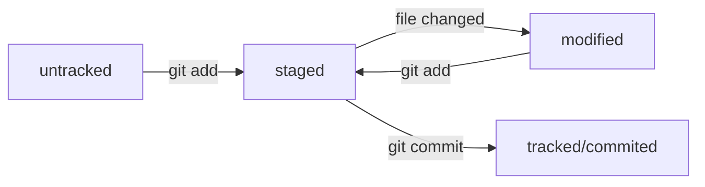

### **Всё, что я знаю о Git, на данном этапе**

## **Что такое Git?**

Git — это программа для контроля версий созданного проекта. Она необходмима для сбора и хранения информации о ранее созданных версиях проекта. 

Это позволяет удобным образом отслеживать вносимые участниками команды изменения и при необходимости откатить проект до одной из сохраненных версий, без необходимости полностью переписывать код. 

## **Какими функциями обладает Git?** 

Сам по себе Git — это текстовый интерфейс для управления папками и файлами, с помощью которого можно: 

1. Создавать директории (папки) и файлы. 
2. Перемещаться между существующими папками и файлами. 
3. Просматривать содержимое файлов и запускать .exe-файлы. 
4. Преобразовывать существующие папки в репозитории для проектов на основе Git. 
5. Сохранять информацию о прошлых версиях в Git-репозиториях.
6. Синхронизировать статус и информацию по прошлым версиям локальных репозиториев с внешними (выложенными на GitHub, к примеру). 
7. Многое другое, до чего я еще не дошёл в курсе. 

## **Базовые команды для управления командной строкой Git.** 

# Команды для перемещения по директориям и проверки их содержимого: 

1. cd — команда для перехода между директориями (cd /c/user/user/).
2. pwd — команда для проверки, в какой директории мы сейчас находимся.
3. ls — команда для проверки содержимого текущей директории. 
4. ~ — символ, определяющий домашнюю директорию. 
5. cat — команда, которая позволяет прочитать содержимое текстового файла в консоли. 

# Команды для управления файлами и директориями: 

1. touch — команда для создания файлов (touch expmple.txt), при создании файла можно сразу указать его расширение. Если не указывать его, создастся пустой файл без расширений. 
2. mkdir — аналогичная команда, но для создания директорий. 
3. rm — команда для удаления файлов (rm example.txt). 
4. rm -r — команда, которая последовательно удаляет всё содержимое директории и её саму. 
5. rmdir — команда для удаления директории, если она пуста. 
6. mv — команда для перемещения файла/директории (mv example.txt ~/git-repository).
7. clip < — команда для копирования в буфер обмена содержимого файла (clip < ~/example.txt).

Команды можно комбинировать между собой, для создания цепочки команд в одной строке. Для этого потребуется отделить команды друг от друга с помощью символов &&. К примеру: touch example.txt && mv example.txt ~/project.

# Команды для управления и создания Git-репозитория: 

1. git init — команда для преобразования **текущей** директории в Git-репозиторий. 
2. git status — команда для проверки текущей версии и всех изменений в проекте, сделанных с момента последнего коммита. 
3. git add — команда, которая заставляет Git начать отслеживать изменения в файле.
4. git commit — команда для подтверждения всех изменений в проекте и создания новой версии проекта. При совершении команды к ней нужно добавлять -m "описание действий и изменений проекта". 
5. git log — команда для просмотра всех совершенных коммитов. Модификатор --oneline позволяет вывести сокращённый лог коммитов.

# Команды для создания и обмена SSH-ключами: 

1. ssh-keygen -t ed25519 -C "your_email@example.com" — команда для создания пары SSH-ключей. При её исполнении в текущей директории создаётся два ключа — публичный (с расширением .pub) и приватный (без расширения). Передавать можно только публичный ключ, приватный должен оставаться известен только вам.
2. ssh -T —  команда для проверки пары для публичного ключа. Пишется в формате ssh -T ссылка@на-удаленный-репозиторий.com. 

#  Команды для привязки и синхронизации удалённого репозитория с локальным. 

1. git remote add — присваивает локальному репозиторию связь с указанным удалённым. Пишется в таком формате: $ git remote add origin git@github.com:%ИМЯ_АККАУНТА%/first-project.git.
2. git remote -v — проверка связи локального и удалённого репозиториев. 
3. git push  — команда для отправки локальных данных на удалённый репозиторий. При первой отправке нужно добавить к команде -u "имярепозитория" main/master.

## **Статусы и состояния файлов**

Ниже можно увидеть схему с отображением переходов статусов файлов от создания и до коммита: 

